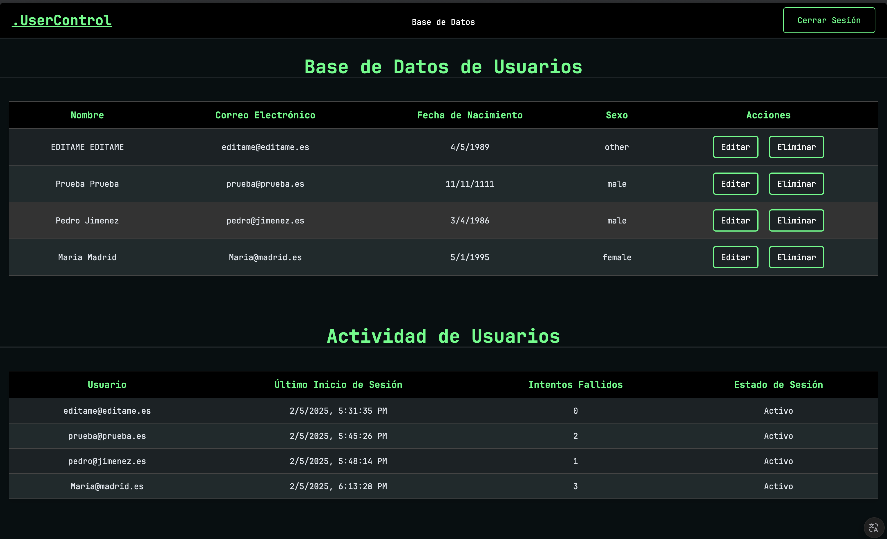

# Bienvenido a [UserControl](https://usercontrol.onrender.com)

Un sistema robusto de gestión de usuarios construido con Node.js y Express, que incluye autenticación segura, seguimiento de actividad de usuarios y una interfaz limpia para administrar datos de usuarios.

## Sobre el Proyecto

Este proyecto demuestra mis capacidades en la construcción de aplicaciones web full-stack con énfasis en la seguridad y gestión de usuarios.<br>
Incluye características como autenticación de usuarios, gestión de sesiones y monitoreo de actividades.<br>
El sistema está diseñado pensando en la escalabilidad y seguridad, implementando las mejores prácticas para la protección de datos de usuarios.<br>
Ten en cuenta que este proyecto puede recibir actualizaciones y mejoras ya que estoy aprendiendo y mejorando mis habilidades.

## Tecnologías Utilizadas

- **Node.js**
- **Express**
- **MongoDB**
- **EJS**
- **Passport.js**
- **Bcrypt**
- **Express-session**
- **Mongoose**
- **CSS**

## Características Principales

- Autenticación y autorización segura de usuarios
- Encriptación de contraseñas con bcrypt
- Gestión de sesiones
- Seguimiento de actividad de usuarios
- Diseño responsive
- Monitoreo de intentos de inicio de sesión fallidos
- Operaciones CRUD de usuarios
- Interfaz adaptable a dispositivos móviles

## Instalación

1. Clona el repositorio:

```bash

git clone https://github.com/0re0re0/UserControl.git

```

2. Instala las dependencias:

```bash

npm install

```

3. Configura las variables de entorno:

```bash

cp .env.example .env

```

Reemplaza los valores con:

- tu_usuario : Usuario de MongoDB

- tu_password : Contraseña de MongoDB

- tu_cluster : URL de tu cluster de MongoDB

- tu_database : Nombre de tu base de datos

- tu_clave_secreta : Una clave secreta única para las sesiones

4. Inicia la aplicación:

```bash

npm run dev

```

## Contacto

Si tienes alguna pregunta o sugerencia, no dudes en contactarme:

- **Email:** cardenas97vga@gmail.com

- **GitHub:** [0re0re0](https://github.com/0re0re0)
